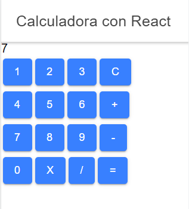
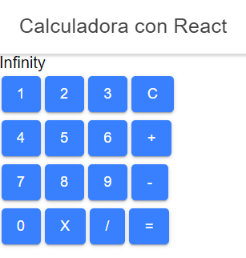

# CalculadoraReact
## Calculadora con Ionic - React 

El proyecto es una calculadora super basica con las 4 operaciones fundamentales de suma resta y multiplicacion
y cuenta con un boton de c para poder eliminar todos los valores guardados en memoria
 
 

tambien esta validado para mandar un mensaje de error en caso de una operacion imposible como es una divicion por 0 

 
